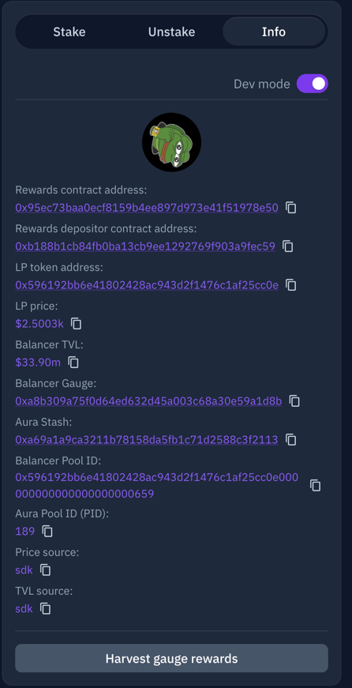

# Ecosystem Balances 
This repo is a demonstration of how to use an API in development to generate user balances across the Balancer ecosystem.
###### Note that BPT refers to Balancer Pool Token, or the deposit token that comes from depositing in a gauge

#### The following positions are considered:

- BPTs in a users wallet
- BPTs staked in the Balancer Gauge
- BPTs deposited into Aura

### How to run it:
There are 3 inputs.  A pool_id, a gauge address and a block number to count at.  The easiest way to get all of this at once is to find the pool on Aura, here is an example for [ezETH/WETH](https://app.aura.finance/#/1/pool/189).

Go to the info tab and turn `Dev Mode` on.  Now you can see the `Balancer Pool Id` and `Balancer Gauge`.  A recent block at the time of this writing is `19192586`.





With this data at hand, here is how you would run at the command line using this file:
```shell
export POOL_ID=0x596192bb6e41802428ac943d2f1476c1af25cc0e000000000000000000000659
export GAUGE=0xa8b309a75f0d64ed632d45a003c68a30e59a1d8b
export BLOCK=19192586
pip3 install -r requirements.txt
python3 ecosystem_deposits_for_1_pool.py
```

You should get some results like this.  You can ignore the preferential gauge messages

```shell
Warning: 12526.432768559198 BPTs were found in the deposited in a bal gauge and zeroed out, but 12526.43276855921 of 'em where counted as gauge deposits.
Warning: 89.60338546450836 BPTs were found in the aura proxy and zeroed out, but 89.60338546450835 of 'em where counted as Aura deposits.
Found 13376.424484124613 of which 12526.432768559198 where staked by an address in a bal gauge and 89.60338546450836 where deposited on aura at block 19192586
CSV file generated successfully:  output.json
```

Check that the program completes and that the warnings are about very smol rounding errors you can accept.

A file named `output.csv` has been created that has BPT balances per user.  

to understand user balances of one component of the pool, you'll need to multiply those BPT balances by the amount of the a specific that was in each BPT on that block.