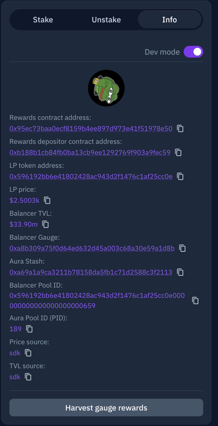

# Ecosystem Balances 
Available result csvs can be found in the [out/ folder on the action-results branch](https://github.com/BalancerMaxis/ecosystem_balances_example/tree/action-results/out)

## Simple Single Pool Script
See [ecosystem_deposits_for_1_pool.md](ecosystem_deposits_for_1_pool.md) for the origianl version of this README and instructions on how to use the simpler single pool depositor from the command line. This README describes [V2](./generate_ecosystem_deposits.py), which is a bit more complex, but more robust with better "UX."

## Multipool Automation
Most of this README describes [generate_ecosystem.deposits.py](generate_ecosystem_deposits.py).

**This script is mainnet only for now.  It could easily be extended so let us know if you need it on other chains**

This repo is a demonstration of how to use an API in development to generate user balances across the Balancer ecosystem.
###### Note that BPT refers to Balancer Pool Token, or the deposit token that comes from depositing in a gauge

#### The following positions are considered:

- BPTs in a users wallet
- BPTs staked in the Balancer Gauge
- BPTs deposited into Aura

### How to configure it:
The [run_pool.json](./run_pools.json) configures what pools are available to run and requires a name, pool_id and gauge address for each monitored pool.  You can find the POOL_ID and GAUGE address for a pool on AURA.

#### Using Aura to get pool_ID and Gauge Address
Find the pool on Aura like this: [ezETH/WETH](https://app.aura.finance/#/1/pool/189).

Go to the info tab and turn `Dev Mode` on.  Now you can see the `Balancer Pool Id` and `Balancer Gauge`.  




## No-code way to use with Github
This repo has a github action that performs the  above steps 15 minutes after each hour, targeting the block after midnight UTC that day.

To generate a custom run, you can use [This Github Action](https://github.com/BalancerMaxis/ecosystem_balances_example/actions/workflows/multipool-cron.yaml).  Click run workflow, and then fill in the inputs which are the same as described above.  Hit run, wait for the action to finish (green).  You can click in to check the run logs.   

Once the action is complete  [action-results](https://github.com/BalancerMaxis/ecosystem_balances_example/tree/action-results/out) branch to find your results.

You may need to ask for help from the Maxis to do this and/or fork the repo.  We're happy to help you setup a custom fork.  This is a POC and there is not the best security controls on the action-results branch. 


### How to run it on my own environment
Like this:
```shell
unset BLOCK
unset TIMESTAMP
unset POOL_ID
pip3 install -r requirements.txt
python3 generate_ecosystem_deposits.py
```
Note that the code above unsets 3 environment variables.  You can instead set them to something as described here:
```shell
export BLOCK=1234567 # Run on block 1234567, ignore timestamp.
export TIMESTAMP=1707519600 # Run at the next block after the UTC unixtimestap 1707519600 (around midnight on february 10th), will be ignored if BLOCK is set.
export POOL_ID=0x05ff47afada98a98982113758878f9a8b9fdda0a000000000000000000000645 # Only run on the weETH/rETH pool.  If unset runs on all known pools.
```


You should get some results like this.  You can ignore the preferential gauge messages

```shell
Warning: 12526.432768559198 BPTs were found in the deposited in a bal gauge and zeroed out, but 12526.43276855921 of 'em where counted as gauge deposits.
Warning: 89.60338546450836 BPTs were found in the aura proxy and zeroed out, but 89.60338546450835 of 'em where counted as Aura deposits.
Found 13376.424484124613 of which 12526.432768559198 where staked by an address in a bal gauge and 89.60338546450836 where deposited on aura at block 19192586
CSV file generated successfully:  output.json
```

The under [./out](./out) you should find a csv for the block and pool_id of all generated pools under directories by name.

Check that the program completes and that the warnings are about very smol rounding errors you can accept.

To understand user balances of one component of the pool, you'll need to multiply those BPT balances by the amount of the a specific that was in each BPT on that block.


## OK cool I want to use this github thing for my points system
If you are going to use this in production, speak to the Maxis.  We can set you up with a fork repo where you have more control and keep an eye on things.

## How can I understand this more?
Tag 0.0.2 of this repo pulls this [commit on bal_addresses](https://github.com/BalancerMaxis/bal_addresses/tree/83a122b0349cde23a0643b83e4adf50859af24fe/bal_addresses).  You can find the classes used in this code there.  You can find the graphql queries and endpoints used [here](https://github.com/BalancerMaxis/bal_addresses/blob/83a122b0349cde23a0643b83e4adf50859af24fe/bal_addresses/queries.py)

A high level understanding of the calculation logic can be understood by reading through the logic of [generate_ecosystem_deposits.py](./generate_ecosystem_deposits.py)

This PoC will eventually result in a release to bal_addresses, and may eventually include more ecosystem positions.  This repo may be updated to use that, but tag 0.0.1 will remain fixed to the current logic.
