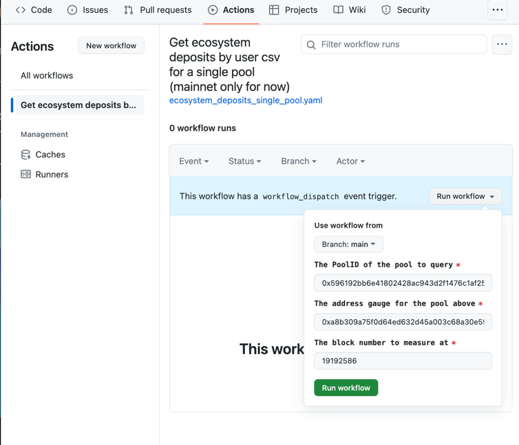

# Ecosystem Balances 
This repo is a demonstration of how to use an API in development to generate user balances across the Balancer ecosystem.
###### Note that BPT refers to Balancer Pool Token, or the deposit token that comes from depositing in a gauge

#### The following positions are considered:

- BPTs in a users wallet
- BPTs staked in the Balancer Gauge
- BPTs deposited into Aura

### How to run it:
There are 3 inputs.  A pool_id, a gauge address and a block number to count at.  The easiest way to get all of this at once is to find the pool on Aura, here is an example for [ezETH/WETH](https://app.aura.finance/#/1/pool/189).

Go to the info tab and turn `Dev Mode` on.  Now you can see the `Balancer Pool Id` and `Balancer Gauge`.  A recent block at the time of this writing is `19192586`.


With this data at hand, here is how you would run at the command line using this file:
```shell
export POOL_ID=0x596192bb6e41802428ac943d2f1476c1af25cc0e000000000000000000000659
export GAUGE=0xa8b309a75f0d64ed632d45a003c68a30e59a1d8b
export BLOCK=19192586
pip3 install -r requirements.txt
python3 ecosystem_deposits_for_1_pool.py
```

You should get some results like this.  You can ignore the preferential gauge messages

```shell
Warning: 12526.432768559198 BPTs were found in the deposited in a bal gauge and zeroed out, but 12526.43276855921 of 'em where counted as gauge deposits.
Warning: 89.60338546450836 BPTs were found in the aura proxy and zeroed out, but 89.60338546450835 of 'em where counted as Aura deposits.
Found 13376.424484124613 of which 12526.432768559198 where staked by an address in a bal gauge and 89.60338546450836 where deposited on aura at block 19192586
CSV file generated successfully:  output.json
```

Check that the program completes and that the warnings are about very smol rounding errors you can accept.

A file named `output.csv` has been created that has BPT balances per user.  

to understand user balances of one component of the pool, you'll need to multiply those BPT balances by the amount of the a specific that was in each BPT on that block.

## No-code way to run with github
This repo has a github action that performs the  above steps.  To use it:

fork the repo, and then go to actions tab on your forked repo.  Select the `Get ecosystem deposits by user csv for a singlke pool` action.  Click `Run Workflow`.  Enter the same details into the boxes and push the Green Button.

Here is the [action page on the main (unforked) repo.](https://github.com/BalancerMaxis/ecosystem_balances_example/actions). 
Here is a screenshot of everything entered using the same values used above:


After about 10 seconds your workflow run will pop up with a orange circle.  You can [click on it to watch it work.](https://github.com/BalancerMaxis/ecosystem_balances_example/actions/runs/7849042795).

It should turn green and generate a [pull request](https://github.com/BalancerMaxis/ecosystem_balances_example/pull/1/files) in the Pull Requests tab if everything worked.  If not it will turn red and you can ask the Maxis or read the output to understand what happened.  There is an end checksum in place, so the job will not finish if there is more than a 1e-10 token difference in the total amount of BPTs and the total amount reported after handling ecosystem substitutions.

### Low-code fanciness
You can change the github action to fix the pool id and gauge in your fork, and remove these as inputs.  Then you only have to put in the block each time.  You could also modify the script slightly to give unique naming to the file that makes sense for you.

## How can I understand this more?
Tag 0.0.1 of this repo pulls this [commit on bal_addresses](https://github.com/BalancerMaxis/bal_addresses/tree/2c7028c745b4a220906ed1b3bb493fa7ba32851d).

A high level understanding of the calculation logic can be found [here](https://github.com/BalancerMaxis/bal_addresses/blob/2c7028c745b4a220906ed1b3bb493fa7ba32851d/bal_addresses/ecosystem_apis.py#L26).

This poc will eventually result in a release to bal_addresses, and may eventually include more ecosystem positions.  This repo may be updated to use that, but tag 0.0.1 will remain fixed to the current logic.
